# CETUS · 无人艇集群云-边-端协同上位机

CETUS 是一套面向**无人艇（USV）集群**的「云侧 · 边侧 · 端侧」三级协同监控与决策上位机软件。
它以可视化方式呈现从云端全局规划、边侧区域协调到艇端单机执行的完整数据闭环，并提供三维场景展示、
历史轨迹回溯、全生命周期档案管理与艇端第一人称（FPV）监控等能力。

- 仓库地址：<https://github.com/ZHT1235456/CETUS>
- 系统设计文档：[`docs/main.tex`](docs/main.tex)
- WebSocket 轨迹协议：[`docs/WS_TRAJECTORY_PROTOCOL.md`](docs/WS_TRAJECTORY_PROTOCOL.md)

---

## 系统架构

软件围绕「云—边—端」三级架构组织，常态下数据沿 **端 → 边 → 云** 汇聚、指令沿 **云 → 边 → 端** 下发，
构成数据闭环；紧急情况下云侧可经**直达链路**接管端侧。

| 层级 | 组成 | 职责 |
| --- | --- | --- |
| **云侧 Cloud Tier** | 集群决策 · 数据收集 · 状态监测与历史回溯 · 全生命周期数据管理 · 数据中心 | 全局态势感知、跨任务全局规划、长周期档案管理 |
| **边侧 Edge Tier** | 任务管理 · 多艇状态汇聚 · 局部规划与在线重构 · 边缘自治与应急处理 · 实时数据库缓存 · Mesh 组网 | 分管水域近实时态势、局部规划、失联应急 |
| **端侧 Terminal Tier** | 全国产域控制器 + 以太网交换机，五域架构 | 单机感知、运动控制与健康状态管理 |

端侧单艇内部按五个功能域组织：

- **感知域** —— 位置、姿态
- **运动控制域** —— 控制输入、速度
- **通信域** —— 时延、丢包率、信号强度
- **机舱域** —— 电源电量、船舱温度
- **预测与健康状态管理域** —— 异常检测、故障监测、健康状态评估

---

## 功能特性

### 系统架构总图

- 可交互的云-边-端全景架构图，所有数据链路带**动态流向动画**
- 常态闭环（端→边→云上行、云→边→端下行）与**紧急直达链路**（云侧直达端侧）一目了然
- 点击图中任意模块即可跳转到对应层级的详细页面

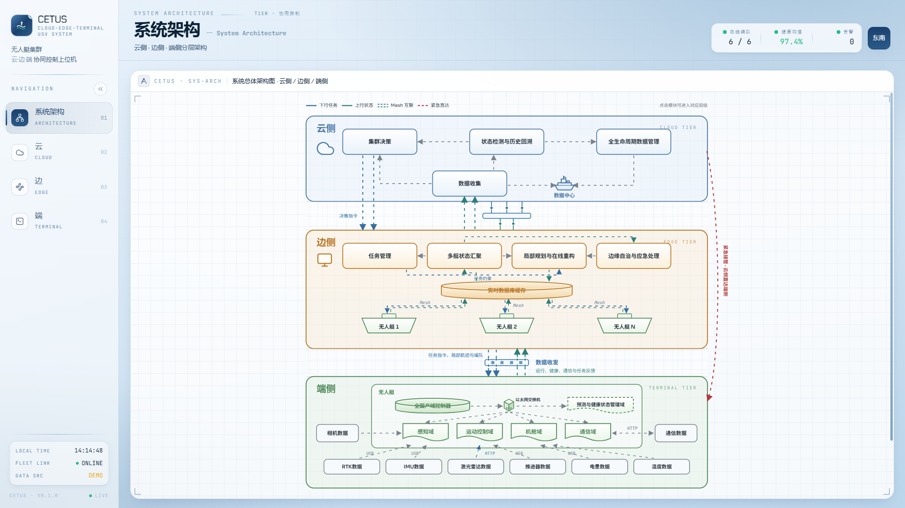

### 云侧

- **云侧架构图**：以「边侧汇聚数据」为主轴的数据流向图，涵盖数据收集、状态监测与历史回溯、
  集群决策、全生命周期数据管理与数据中心

  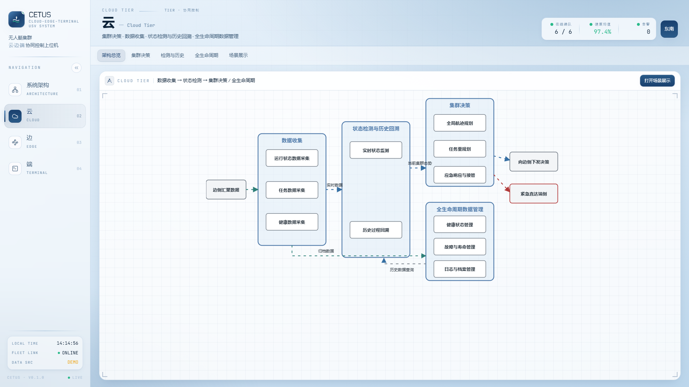

- **集群决策**：左侧实时态势平面 + 右侧当前全局态势卡片，呈现六艇全部遥测数据

  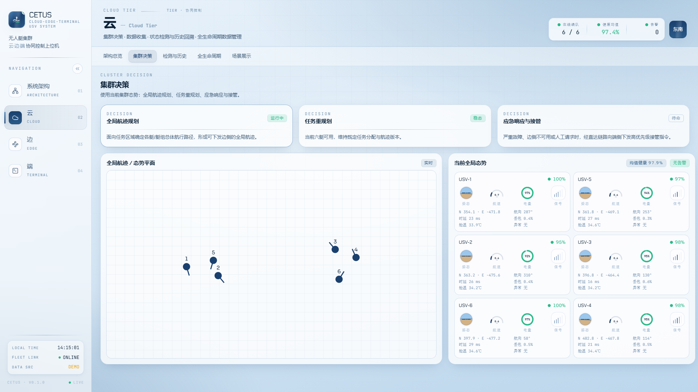

- **状态监测与历史回溯**：健康度曲线、历史轨迹回放（播放 / 暂停 / 倍速 / 时间轴拖动）

  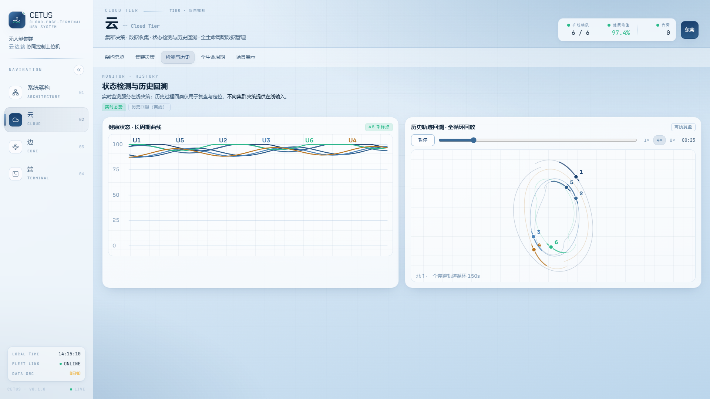

- **全生命周期数据管理**：档案卷宗风格的艇档案索引与事件簿，支持滚动检索

  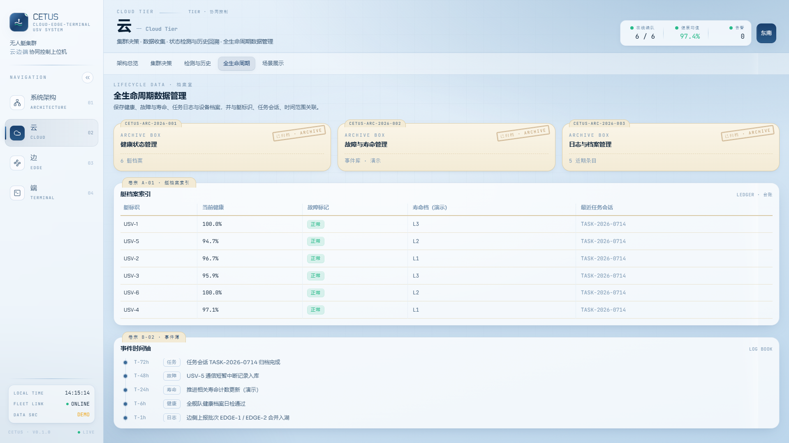

- **场景展示**：基于 Three.js 的三维集群场景 —— 六艇自定义编队轨迹、渐隐尾迹、
  斜视 / 俯视相机（锚定于初始编队中心）、右侧集群态势面板

  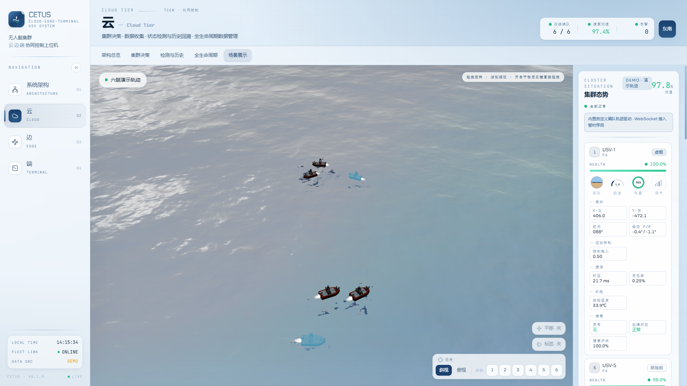

### 边侧

- **边侧架构图**：任务管理 → 多艇状态汇聚 → 局部规划 / 边缘自治的数据流，
  含实时数据库缓存与 Mesh 组网链路

  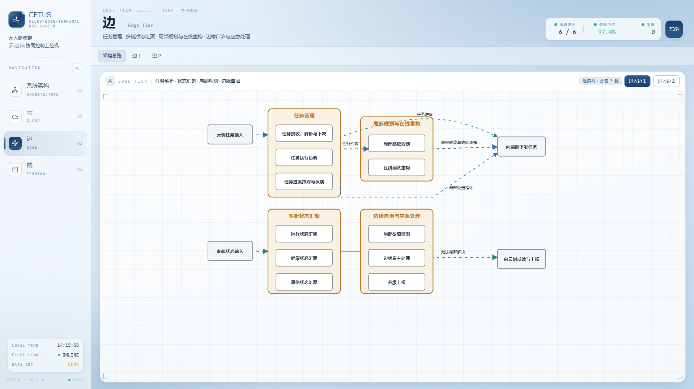

- **边站点（边 1 / 边 2）**：分管水域**水面俯视图**，真实还原三艘成员艇的相对位置与航向，
  成员卡片展示位置、姿态、速度等全部遥测

  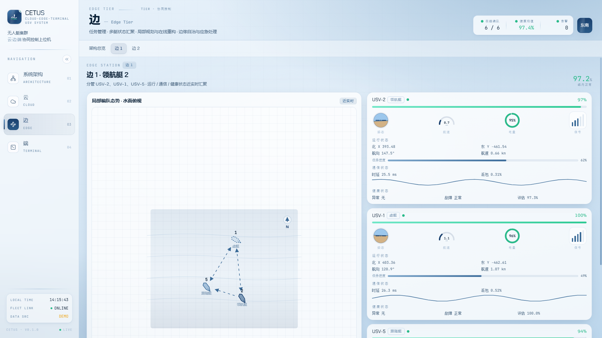
  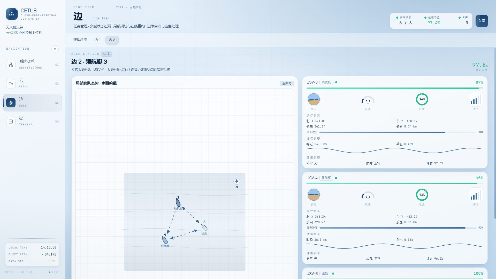

### 端侧

- **端侧架构图**：单艇五域（感知 / 运动控制 / 通信 / 机舱 / 预测与健康状态管理）数据流

  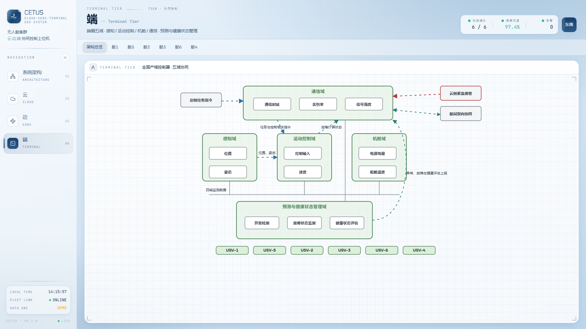

- **单艇页（USV-1 ~ USV-6）**：每艇一页，包含
  - **第一人称视角（FPV）**画面，模拟艇载相机所见的水面与编队
  - Bento 网格仪表盘：位置、姿态、速度、控制输入、通信时延 / 丢包率 / 信号强度、
    电源电量、船舱温度、健康评估等全量数据

  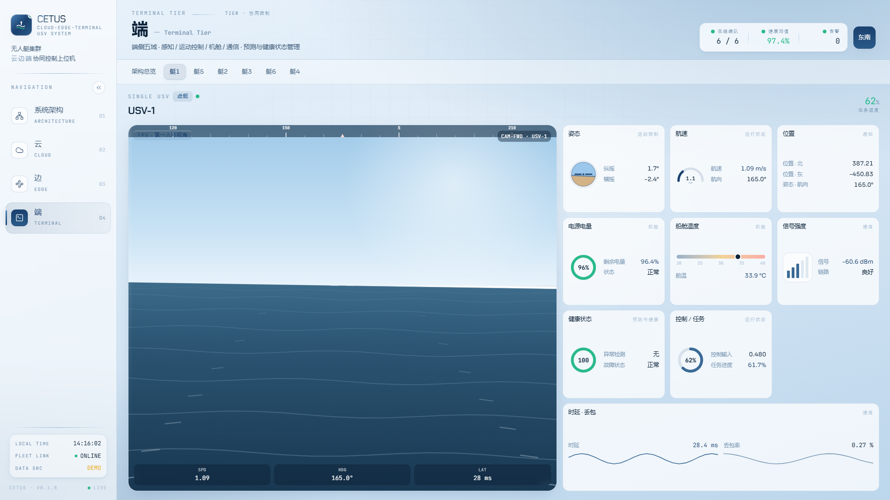
  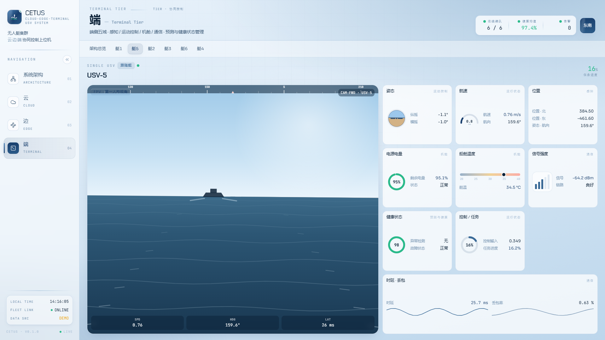

- 左侧导航栏支持**收起**，为可视化区域腾出空间

---

## 技术栈

| 类别 | 技术 |
| --- | --- |
| 前端框架 | React 19 + TypeScript + Vite |
| 样式 | Tailwind CSS v4 |
| 三维渲染 | Three.js |
| 架构图 | 自绘 SVG（动态流向箭头）+ @xyflow/react |
| 状态管理 | Zustand |
| 路由 | React Router v7 |
| 桌面端 | Tauri 2 |
| 代码检查 | oxlint + tsc |
| 数据链路 | WebSocket（Python 发送端 → 网页 / 桌面客户端） |

---

## 运行方式

### 环境要求

- Node.js ≥ 18（建议 LTS）
- npm
- （可选，桌面端）Rust 工具链 + Tauri 2 系统依赖

### 网页端开发

```bash
npm install
npm run dev
```

启动后访问 <http://localhost:5173>。

### 构建与预览

```bash
npm run build      # 类型检查 + 产物构建（dist/）
npm run preview    # 本地预览构建产物
```

### 桌面端（Tauri）

```bash
npm run tauri dev     # 开发模式启动桌面窗口
npm run tauri build   # 打包桌面安装包
# 或一键构建 exe：
npm run build:exe
```

### 常用校验命令

```bash
npm run typecheck   # TypeScript 类型检查
npm run lint        # oxlint 代码检查
```

---

## 数据模式

### 演示轨迹（默认）

软件默认处于**演示模式**：`src/hooks/useFleetRuntime.ts` 中 `ENABLE_LIVE_WS = false`，
六艘无人艇按内置的 150 秒循环自定义编队轨迹运动，无需任何外部数据源即可体验全部功能
（三维场景、轨迹回放、健康曲线、档案事件等均由演示数据驱动）。

### 接入真实艇数据（WebSocket）

1. 将 `src/hooks/useFleetRuntime.ts` 中的 `ENABLE_LIVE_WS` 置为 `true`；
2. 在协同计算机上运行 Python 发送端（作为 WebSocket 服务端，默认监听 `0.0.0.0:5005`）：

   ```bash
   pip install -r tools/requirements.txt
   python tools/send_trajectory.py
   ```

3. 网页端默认连接 `ws://127.0.0.1:5005`；跨机器时在云端页右侧「发送端」输入 Python 电脑的
   局域网 IP 与端口并连接，设置会持久化保存。

消息帧格式、字段含义与超时 / 重连行为详见
[`docs/WS_TRAJECTORY_PROTOCOL.md`](docs/WS_TRAJECTORY_PROTOCOL.md)。
`tools/test_send_trajectory.py` 提供协议自检测试。

---

## 目录结构

```
CETUS/
├── assets/                 # 设计素材与界面截图
│   └── screenshots/        # README 用截图
├── docs/                   # 设计文档（main.tex）与 WS 轨迹协议
├── scripts/                # 打包脚本（build-exe.mjs）
├── src/
│   ├── App.tsx             # 应用入口与路由
│   ├── components/         # 架构图、三维场景、仪表盘、导航等组件
│   ├── config/             # 编队与边站配置（fleet.ts / edgeStations.ts）
│   ├── hooks/              # useFleetRuntime（演示轨迹 / WS 运行时）
│   ├── routes/             # 页面：架构总览 + cloud / edge / terminal
│   ├── store/              # Zustand 艇群状态（usvStore.ts）
│   └── types/              # 遥测与帧类型定义
├── src-tauri/              # Tauri 桌面端配置
└── tools/                  # Python 轨迹发送端与协议测试
```

---

## 许可

本项目为研究生课题（系统科学）配套软件，仅供学习与研究使用。
